# Lab 01

## Bài 1: Thiết lập môi trường

### 1.1 Đăng ký tài khoản MongoDB Atlas và tạo cluster miễn phí trên dịch vụ đám mây

Đăng ký tài khoản

Ta có thể chọn đăng ký tài khoản hoặc login bằng các phương thức khác như Gmail hoặc Github, ở đây để cho thuận tiện ta sử dụng Gmail để login.

Tạo Cluster

Giao diện tạo Cluster:

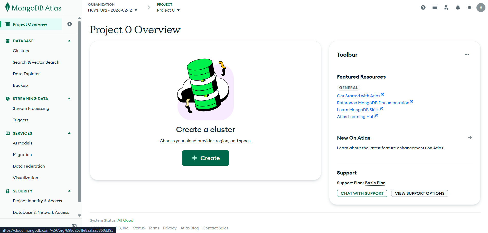

Cấu hình Cluster
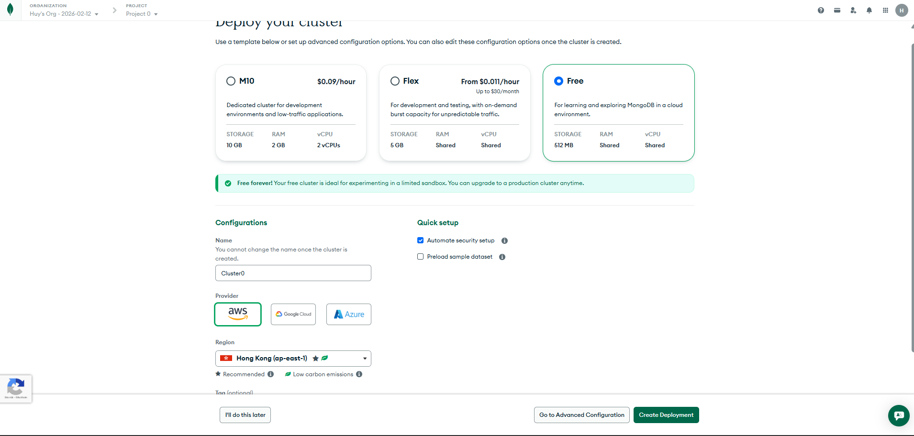

### 1.2 Tìm nạp dữ liệu mẫu trên MongoDB Atlas vào Cluster

Sau khi tạo Cluster, click vào "Load Sample Data" để mở cửa sổ chọn sample datasets
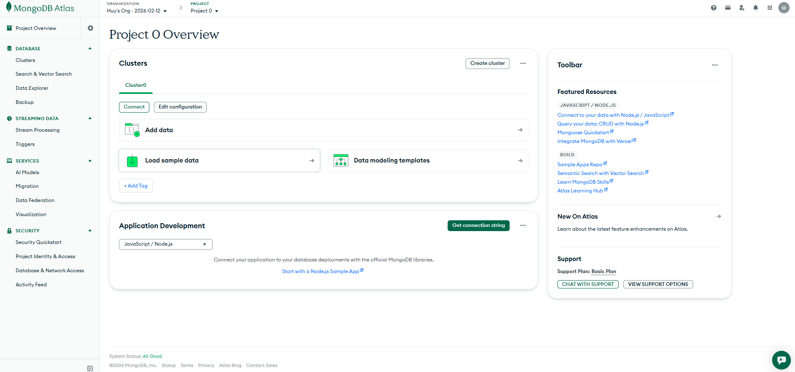
Click Load sample data để tiến hành nạp dữ liệu mẫu lên Cluster
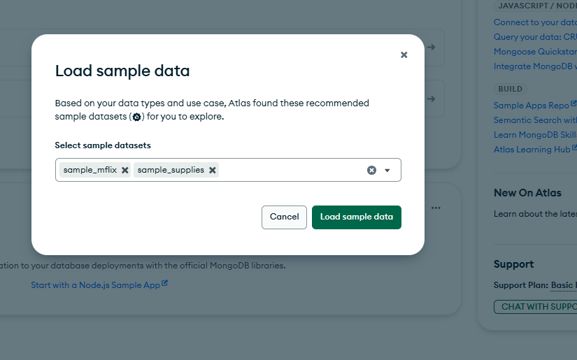
Dữ liệu mẫu đã được nạp vào Cluster
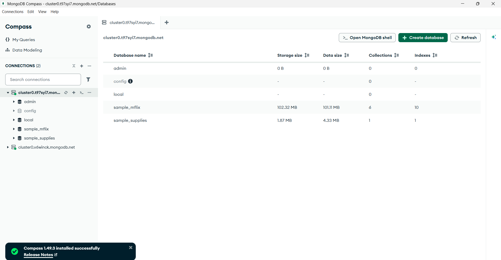

### 1.3 Cài đặt MongoDB Compass trên máy tính

Nhấn vào button "Connect" trên Cluster sau đó nhấn vào compass, tiếp theo bấm chọn "I don't have MongoDB Compass installed"

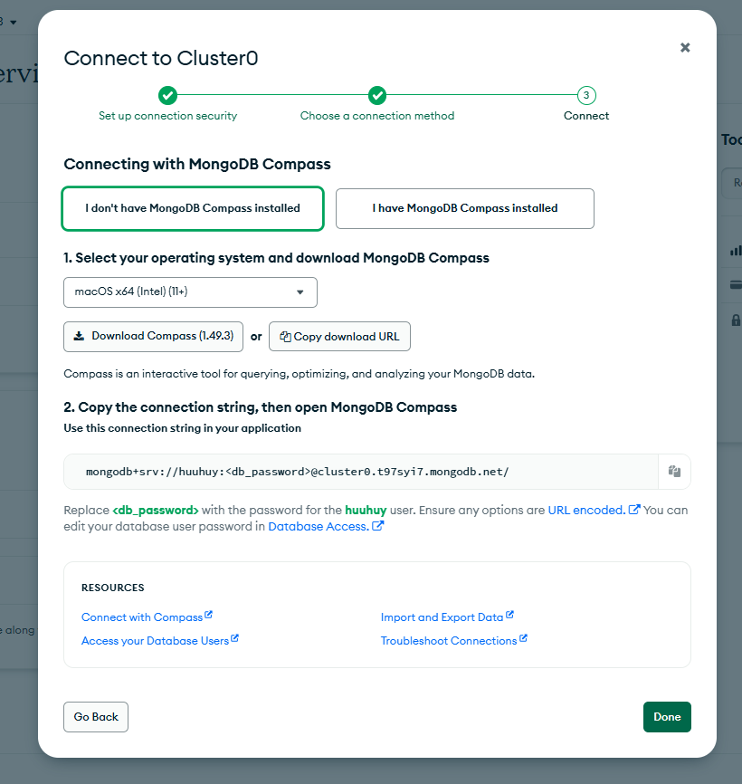

Tiếp theo đó thực hiện cài đặt bản MongoDB Compass được đề xuất

### 1.4 Kết nối MongoDB Compass với cluster đã tạo trên MongoDB

Để thực hiện kết nối MongoDB Compass với cluster đã tạo trên MongoDB, ta thực hiện như sau

- Vào mục "Security Quickstart" để thực hiện lấy password
  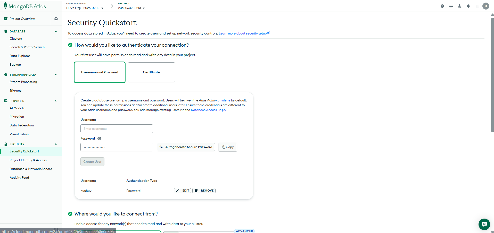

- Quay lại trang "Project Overview" và nhấn connect
  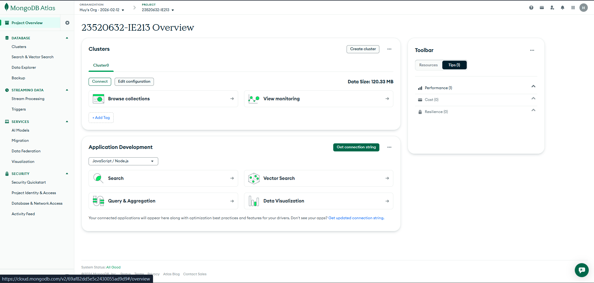

- Chọn Compass
  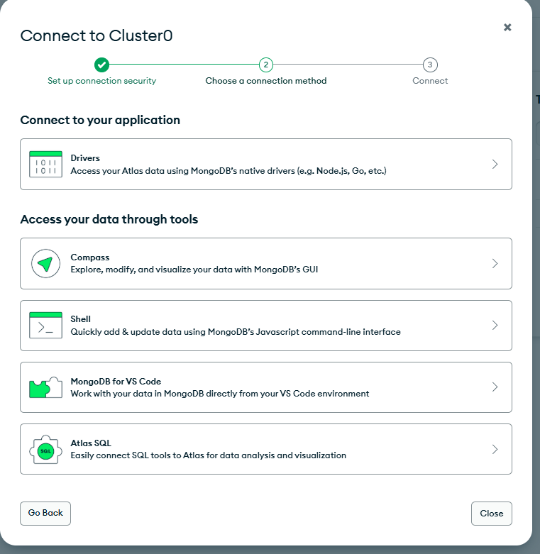
- Chọn "I have MongoDB Compass installed", copy đoạn text để tiến hành connect
  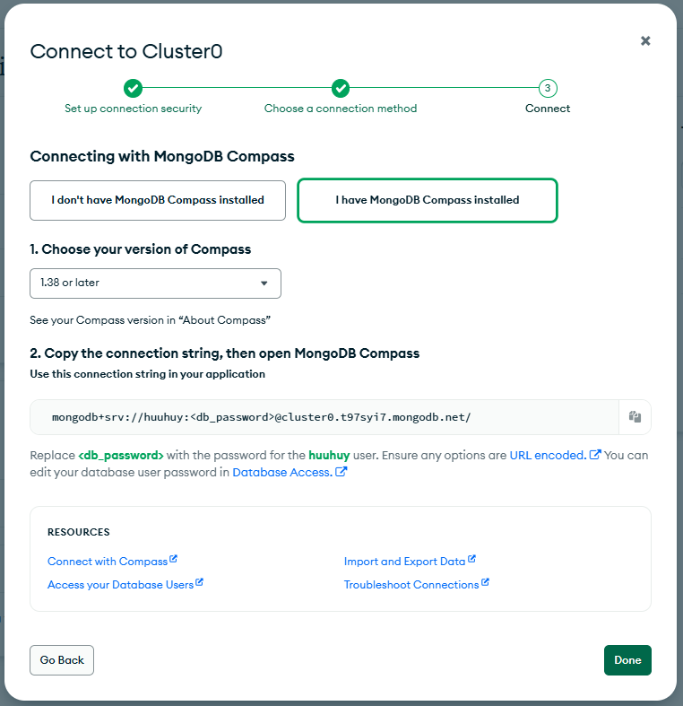
- Mở MongoDB Compass, nhấn vào Connect sau đó pass đoạn mã vừa copy vào trong ô text.

### Lưu ý: Thay thế db_password> bằng mật khẩu đã lấy được ở "Security Quickstart"

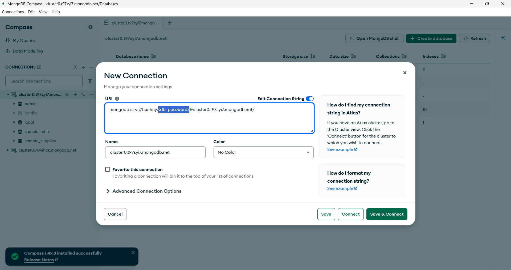

Giao diện sau khi đã connect thành công
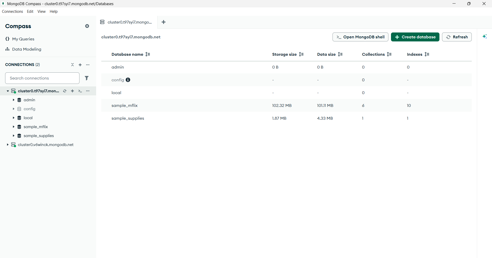

## Bài 2: Sử dụng MONGOSH

### 2.1 Tạo CSDL có tên 23520632-IE213 trên Cluster

Để mở MONGOSH ta nháy cuột phải vào Open MongoDB Shell


Để tạo CSDL mới có tên 23520632-IE213 ta sử dụng lệnh sau:

> use 23520632-IE213

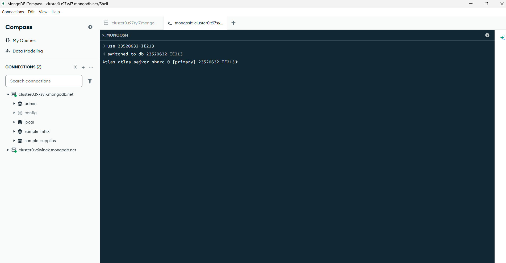

Ta đã tạo thành công CSDL có tên 23520632-IE213 trên Cluster

### 2.2 Thêm các document sau đây vào collection có tên là employees trong db vừa được tạo

```json
{"id":1,"name":{"first":"John","last":"Doe"},"age":48}
{"id":2,"name":{"first":"Jane","last":"Doe"},"age":16}
{"id":3,"name":{"first":"Alice","last":"A"},"age":32}
{"id":4,"name":{"first":"Bob","last":"B"},"age":64}
```

Để thực hiện yêu cầu trên ta sử dụng insertMany()

```json
db.employees.insertMany([
    {"id":1,"name":{"first":"John","last":"Doe"},"age":48},
    {"id":2,"name":{"first":"Jane","last":"Doe"},"age":16},
	{"id":3,"name":{"first":"Alice","last":"A"},"age":32},
	{"id":4,"name":{"first":"Bob","last":"B"},"age":64},
])
```

Kết quả sau khi thêm

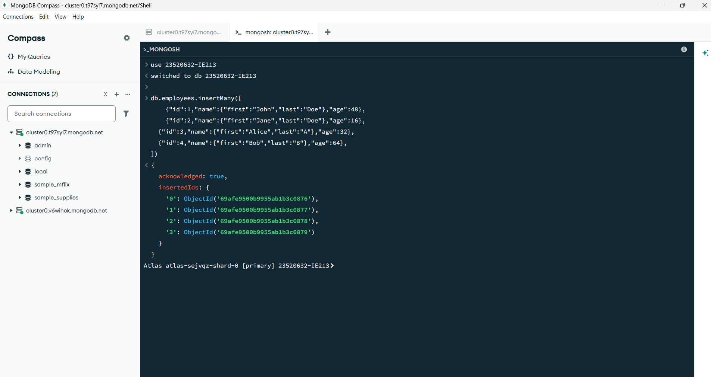

### 2.3 Biến trường id trong các document trên trở thành duy nhất. Có nghĩa là không thể thêm một document mới với giá trị id đã tồn tại.

Để thực hiện yêu cầu trên ta sử dụng lệnh createIndex()

```json
db.employees.createIndex({ id: 1 }, { unique: true })
```

Kết quả thu được

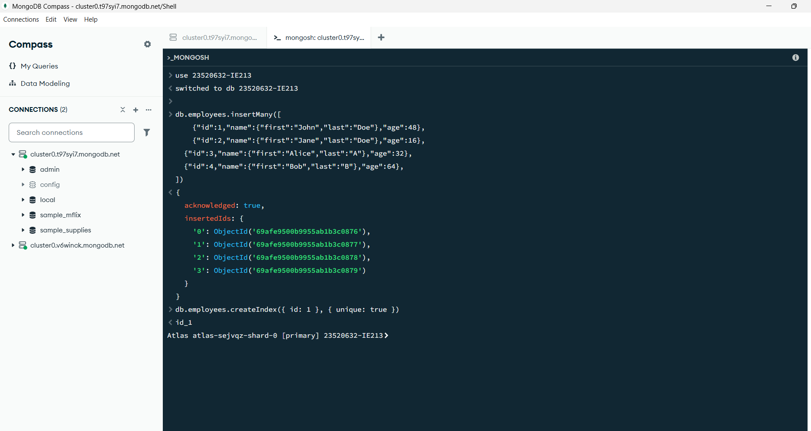

### 2.4 Viết lệnh để tìm document có firstname là John và lastname là Doe.

Để thực hiện yêu cầu trên ta thực hiện lệnh find() với các bộ lọc name.first và name.last cụ thể như sau:

```json
db.employees.find({"name.first":"John", "name.last":"Doe"})
```

Kết quả thu được

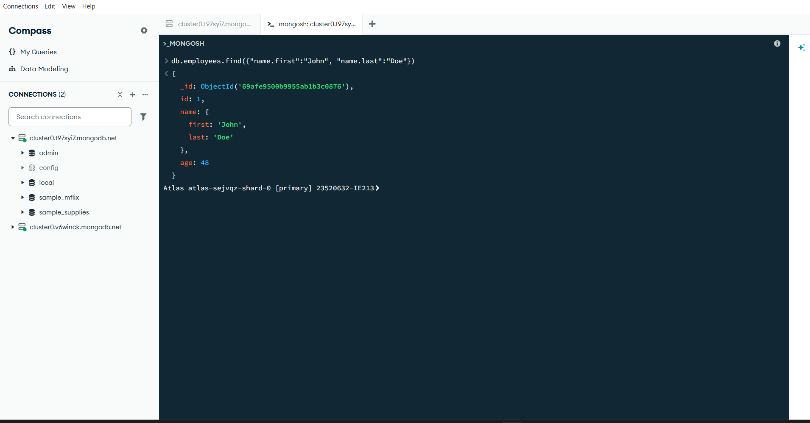

### 2.5 Viết lệnh để tìm những người có tuổi trên 30 và dưới 60.

Để thực hiện yêu cầu trên ta sử dụng lệnh find() và toán tử $and cùng với bộ lọc age cụ thể như sau:

```json
db.employees.find({
  $and: [
  	{ age: { $gt: 30 } },
    { age: { $lt: 60 } }
  ]
})
```

Kết quả thu được

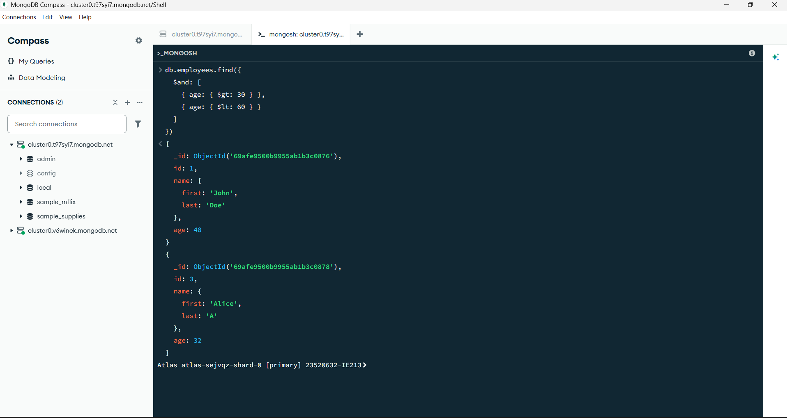

### 2.6 Thêm các document sau đây vào collection. Sau đó viết lệnh để tìm tất cả các document có middle name.

```json
{"id":5,"name":{"first":"Rooney", "middle":"K", "last":"A"},"age":30}
{"id":6,"name":{"first":"Ronaldo", "middle":"T", "last":"B"},"age":60}
```

Để thêm các document trên đây vào collection ta sử dụng lệnh:

```json
db.employees.insertMany([
    {"id":5,"name":{"first":"Rooney", "middle":"K", "last":"A"},"age":30},
    {"id":6,"name":{"first":"Ronaldo", "middle":"T", "last":"B"},"age":60}
])
```

Kết quả thu được

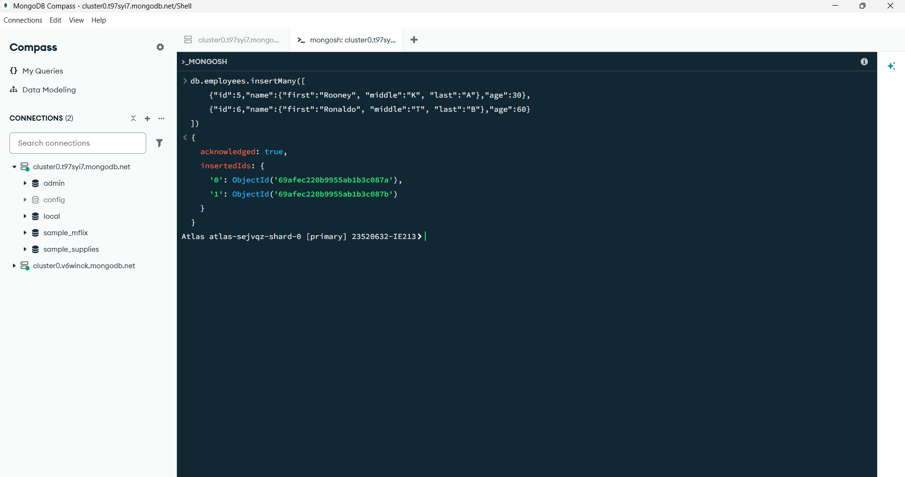

### 2.7 Cho rằng là những document nào đang có middle name là không đúng, hãy xoá middle name ra khỏi các document đó.

Để thực hiện yêu cầu trên ta sử dụng lệnh updateMany() trong đó dùng toán tử $unset: null với các document có middle name

```json
    db.employees.updateMany(
  { "name.middle": { $exists: true} },
  { $unset: { "name.middle": null} }
)
```

Kết quả thu được

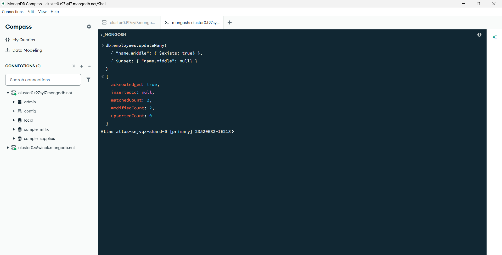

### 2.8 Thêm trường dữ liệu organization: "UIT" vào tất cả các document trong employees collection.

Để thực hiện yêu cầu trên ta dùng updateMany() trong đó dùng toán tử $set với cặp khoá – giá trị là organization: "UIT"

```json
db.employees.updateMany(
  {},
  { $set: { "organization": "UIT" } }
)
```

Kết quả thu được


### 2.9 Hãy điều chỉnh organization của nhân viên có id là 5 và 6 thành "USSH".

Để thực hiện yêu cầu trên, ta dùng updateMany() trong đó dùng toán tử $set với cặp khoá – giá trị là organization: "USSH" với các document có id 5 và 6

```json
db.employees.updateMany(
  { id: { $in: [5, 6] } },
  { $set: { organization: "USSH" } }
)
```

Kết quả thu được


### 2.10 Viết lệnh để tính tổng tuổi và tuổi trung bình của nhân viên thuộc 2 organization là UIT và USSH.

Để thực hiện yêu cầu trên ta dùng aggregate() trong đó dùng toán tử $group với _id: "$organization"

```json
db.employees.aggregate([
  {
    $group: {
      _id: "$organization",
      totalAge: { $sum: "$age" },
      avgAge: { $avg: "$age" }
    }
  }
])
```

Kết quả thu được


