# Lab 2

## Bài 1. Thiết lập môi trường

### 1.1 Tải và cài đặt nodejs - nodejs.org. (Kiểm tra thành công với câu lệnh node -v trên giao diện như terminal trên MacOS, Linux, và cmd, powershell trên Windows).

Tại https://nodejs.org/en/download thực hiện tải node js tương ứng với cấu hình máy

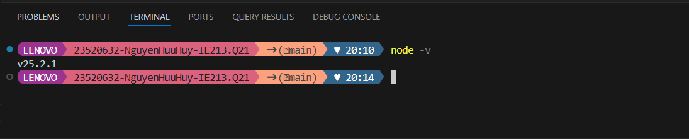

### 1.2 Tải và cài đặt một trong các công cụ soạn thảo và quản lý mã nguồn như: Visual Studio Code, Sublime Text, Notepad++,...

Trong phần này ta sẽ sử dụng visual studio code

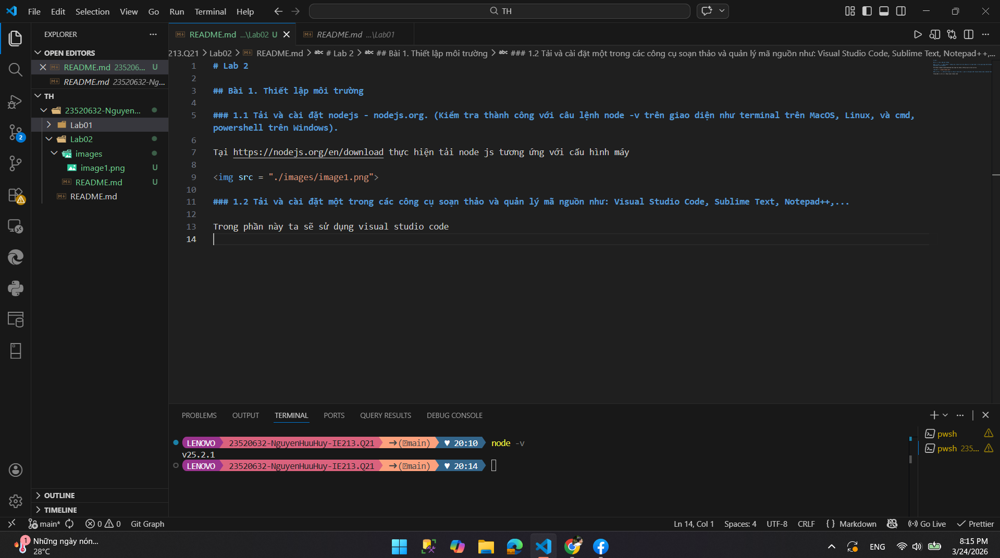

### 1.3 Khởi tạo cây thư mục chứa mã nguồn của dự án

```json
Khởi tạo với lệnh: mkdir movie-reviews/backend
```

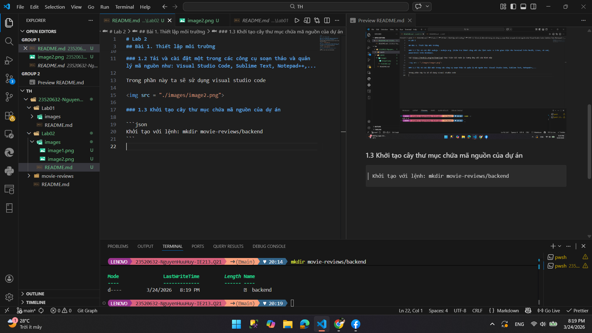

### 1.4 Khởi tạo dự án với câu lệnh npm init

```json
Khởi tạo với lệnh:
    cd movie-reviews/backend
    npm init
```

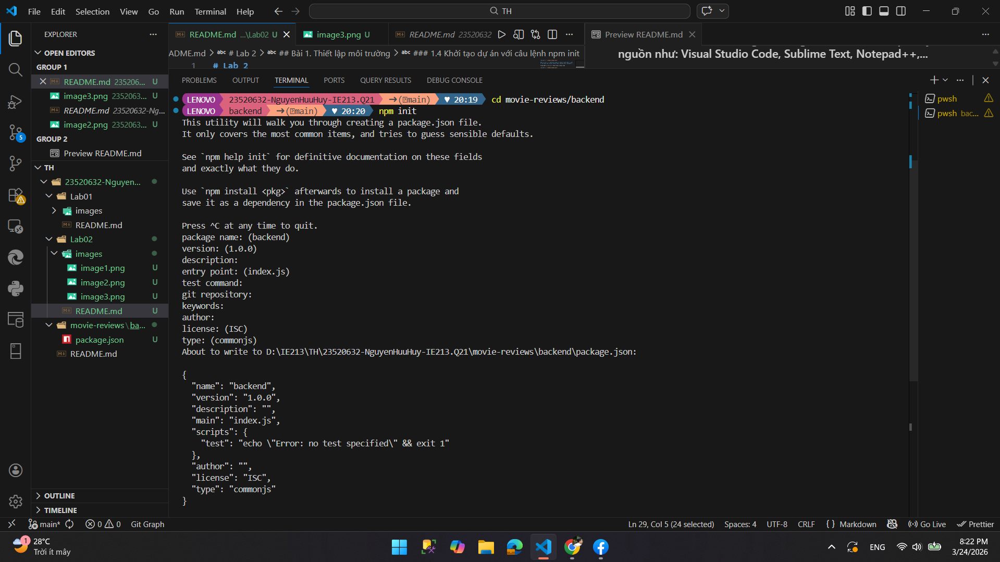

### 1.5 Cài đặt một số dependency của dự án như mongodb, express, cors, dotenv.

```json
Ta sử dụng lệnh: npm install mongodb express cors dotenv
```

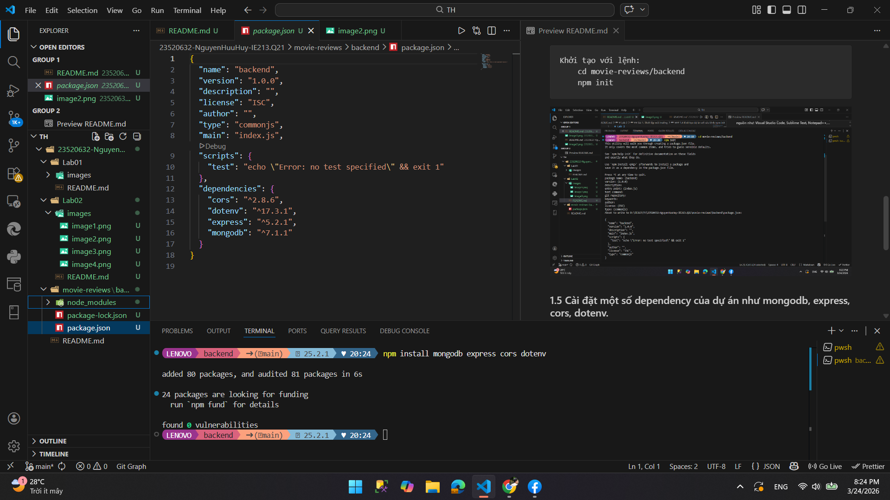

### 1.6 Cài đặt nodemon - công cụ giúp khởi động lại máy chủ web khi có sự thay đổi về mã nguồn

```json
Ta sử dụng lệnh: npm install -d nodemon #-d là viết tắt của --dev
```

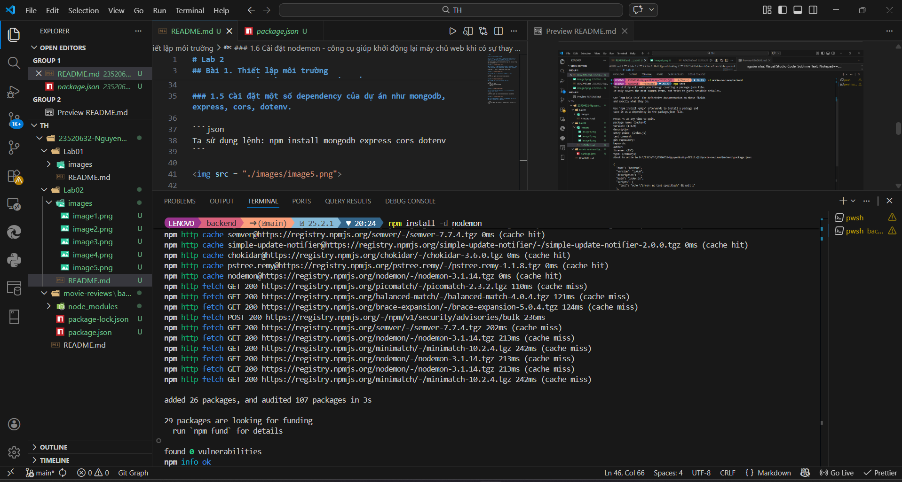

## Bài 2: Thiết lập Backend

### 2.1 Tạo tệp tin server.js là nơi khởi tạo máy chủ web (tệp này nằm trong thư mục backend).

- Trong tệp tin này cần thêm các dependency như express, cors để sử dụng các phương thức (middleware) của chúng.
- Đồng thời, nội dung tệp tin này cũng chứa một số routing cơ bản cho máy chủ web, như xử lý lỗi 404, định tuyến tới /api/v1/movies (xem phần 2.4).

Nội dung file server.js

```javascript
import express from "express";
import cors from "cors";
import movies from "./api/movies.route.js";

const app = express();

app.use(cors());
app.use(express.json());

app.use("/api/v1/movies", movies);
app.use((req, res) => {
  res.status(404).json({ error: "not found" });
});

export default app;
```

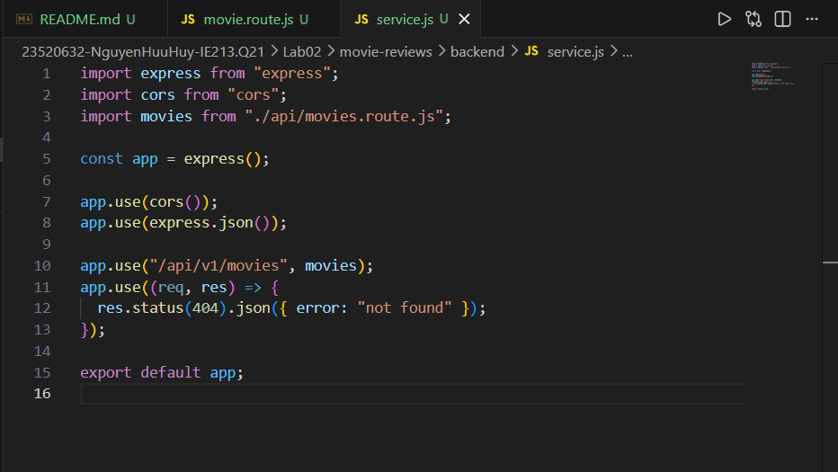

### 2.2 Tạo tệp tin .env để lưu trữ thông tin biến môi trường phát triển như URI kết nối tới DB trên MongoDB Atlas, PORT dịch vụ web, ví dụ 3000.

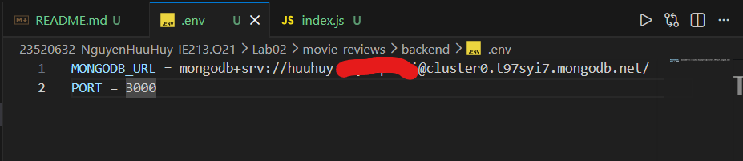

### 2.3 Tạo tệp tin index.js để quản lý việc kết nối dữ liệu, khởi tạo đối tượng, và chạy máy chủ.

Nội dung file index.js

```javascript
import app from "./server.js";
import mongodb from "mongodb";
import dotenv from "dotenv";

dotenv.config();

const MongoClient = mongodb.MongoClient;
const uri = process.env.MONGODB_URI;
const port = process.env.PORT || 8080;

const client = new MongoClient(uri);

async function run() {
  try {
    await client.connect();
    console.log("Connected to MongoDB");
  } catch (e) {
    console.error(e);
    process.exit(1);
  }
}

run().catch(console.error);

app.listen(port, () => {
  console.log(`Server running on port ${port}`);
});
```

### 2.4 Tạo thư mục và tệp tin tương ứng trong thư mục backend gồm api/movies.route.js để xử lý các định tuyến liên quan đến ứng dụng minh hoạ movies về sau.

Trong nội dung này, hiện tại để một định tuyến duy nhất ‘/’ trả về cho máy khách thông báo ‘hello world’. Ví dụ máy khách truy cập: localhost:3000/api/v1/movies thì sẽ trả về ‘hello world’.

Nội dung file movies.route.js:

```javascript
import express from "express";

const router = express.Router();

router.get("/", (req, res) => {
  res.send("hello world");
});

export default router;
```

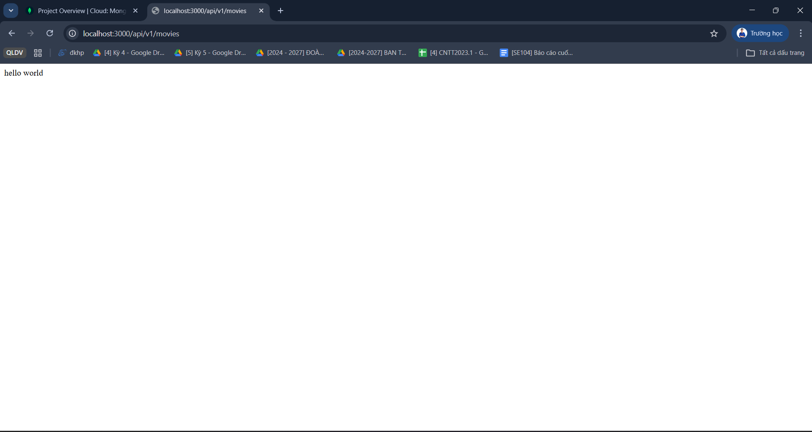

### 2.5 Thiết lập công cụ truy xuất dữ liệu cho ứng dụng Movie với DAO – Data Access Object.

- Tạo thư mục dao trong thư mục backend, tạo tệp tin moviesDAO.js trong thư mục này.
- Tệp tin moviesDAO.js hiện tại sẽ bao gồm class MoviesDAO chứa 2 phương thức chính là:
  - injectDB(): dùng để tham chiếu tới dữ liệu collection movies trên sample_mflix.
  - getMovies(): để trả về danh sách các movies và số lượng các movies trả về thông qua 2 tham số: moviesList và totalNumMovies, với bộ lọc mặc định là: không có bộ lọc, bắt đầu từ trang 0, và mỗi trang có 20 phim là tối đa.
- Khởi tạo đối tượng của lớp MoviesDAO trong tệp tin index.js để sử dụng phương thức injectDB(). Phương thức này sẽ được gọi sau khi kết nối tới cơ sở dữ liệu trên MongoAtlas Cloud và trước khi máy chủ được chạy.

File moviesDAO.js

```javascript
let movies;

export default class MoviesDAO {
  //Phương thức injectDB()
  static async injectDB(conn) {
    if (movies) {
      return;
    }
    try {
      movies = await conn.db(process.env.MOVIEREVIEWS_NS).collection("movies");
    } catch (e) {
      console.error(`unable to connect in MoviesDAO: ${e}`);
    }
  }
  //getMovies()
  static async getMovies({
    filters = null,
    page = 0,
    moviesPerPage = 20,
  } = {}) {
    let query;
    if (filters) {
      if ("title" in filters) {
        query = { $text: { $search: filters["title"] } };
      } else if ("rated" in filters) {
        query = { rated: { $eq: filters["rated"] } };
      }
    }

    let cursor;
    try {
      cursor = await movies
        .find(query)
        .limit(moviesPerPage)
        .skip(moviesPerPage * page);
      const moviesList = await cursor.toArray();
      const totalNumMovies = await movies.countDocuments(query);
      return { moviesList, totalNumMovies };
    } catch (e) {
      console.error(`Unable to issue find command, ${e}`);
      return { moviesList: [], totalNumMovies: 0 };
    }
  }
}
```

### 2.6 Thiết lập CONTROLLER cho ứng dụng web để gọi tới DAO

Tạo tệp tin movies.controller.js trong thư mục api để thực hiện tác vụ trung gian, tiếp nhận yêu cầu từ máy khách thông qua api (endpoint) sau đó định tuyến (route) tới function trong dao movies phù hợp.

- Trong class MoviesController tạo function apiGetMovies() trả về chuỗi json để gửi về cho máy khách. Trong function này sẽ có bước gọi tới hàm getMovies() đã định nghĩa trong dao Movie.

File movies.controller.js

```javascript
import MovieDAO from "../dao/movieDAO";

export default class MoviesController {
  static async apiGetMovies(req, res, next) {
    const moviesPerPage = req.query.moviesPerPage
      ? parseInt(req.query.moviesPerPage)
      : 20;
    const page = req.query.page ? parseInt(req.query.page) : 0;
    const filters = {};

    if (req.query.rated) {
      filters.rated = req.query.rated;
    } else if (req.query.title) {
      filters.title = req.query.title;
    }

    const { moviesList, totalNumMovies } = await MovieDAO.getMovies({
      filters,
      page,
      moviesPerPage,
    });

    let response = {
      movies: moviesList,
      page: page,
      filters: filters,
      entries_per_page: moviesPerPage,
      total_results: totalNumMovies,
    };
    res.json(response);
  }
}
```

### 2.7 Đưa Controller vừa tạo ở yêu cầu 2.6 vào định tuyến.

Ví dụ: Khi máy khách gửi một http request như sau: localhost:3000/api/v1/movies/ thì máy chủ web sẽ gọi hàm apiGetMovies trong MoviesController để xử lý yêu cầu này và trả về thông tin trên browser như hình:

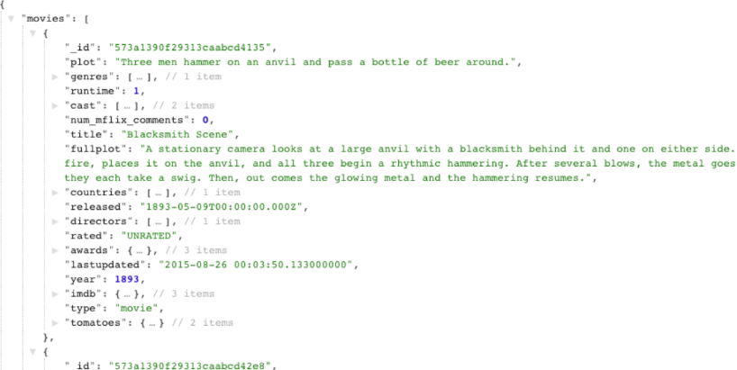

Cập nhật movie.route.js

```javascript
import express from "express";
import MoviesController from "./movies.controller.js";

const router = express.Router();

router.route("/").get(MoviesController.apiGetMovies);

export default router;
```

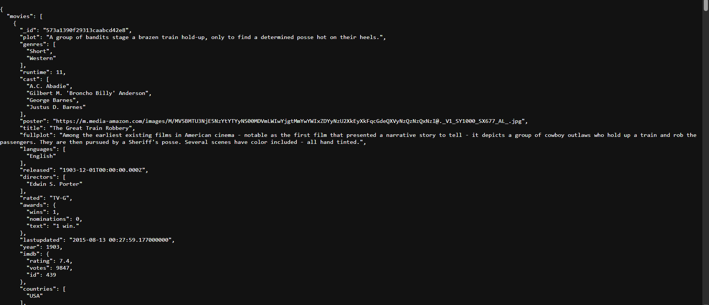
