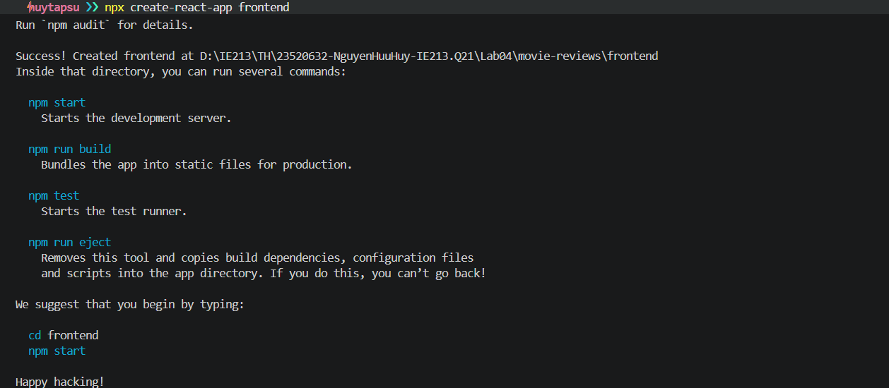
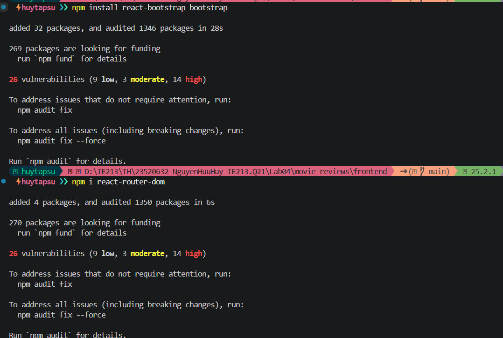
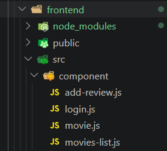
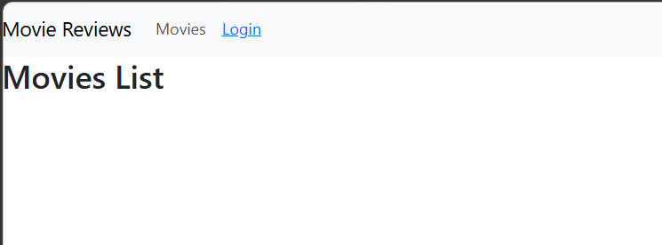
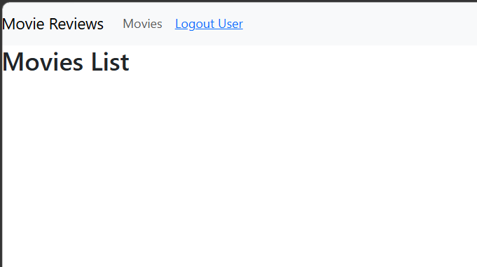

# Bài thực hành 4

## THIẾT LẬP FRONTEND VỚI REACTJS

### Bài 1: Thiết lập nơi làm việc với frontend của dự án

#### 1.1 Tạo template frontend với React

Ta sử dụng lệnh "npx create-react-app tên dự án" để khởi tạo dự án React cơ bản trong thư mục movie-reviews
'

#### 1.2 Cài đặt các package hỗ trợ

Cài đặt thư viện Bootstrap để xây dựng giao diện và React Router Dom để quản lý định tuyến chuyển trang

```javascript
cd frontend
npm install react-bootstrap bootstrap
npm i react-router-dom
```



### Bài 2: Xây dựng Navigation Header bar

#### 2.1 Xây dựng các Component

Tạo thư mục component trong src, trong thư mục component tạo các file sau :

- movies-list.js: hiển thị thông tin danh sách phim.
- movie.js: hiển thị phim với các review.
- add-review.js: hỗ trợ thêm review cho khách.
- login.js: trang đăng nhập cho khách.



#### 2.2 & 2.3 Thiết lập Navbar trong App.js

```javascript
import React from "react";
import { Switch, Route, Link } from "react-router-dom";
import "bootstrap/dist/css/bootstrap.min.css";

import Nav from "react-bootstrap/Nav";
import Navbar from "react-bootstrap/Navbar";

import AddReview from "./components/AddReview";
import Login from "./components/Login";
import MoviesList from "./components/MoviesList";
import Movie from "./components/Movie";

function App() {
  const [user, setUser] = React.useState(null);

  async function login(user = null) {
    //default user to null
    setUser(user);
  }
  async function logout() {
    setUser(null);
  }

  return (
    <div className="App">
      <Navbar bg="light" expand="lg">
        <Navbar.Brand href="#home">Movie Reviews</Navbar.Brand>
        <Nav className="me-auto">
          <Nav.Link as={Link} to={"/movies"}>
            Movies
          </Nav.Link>
          <Nav.Link>
            {user ? (
              <a onClick={logout} href="#">
                Logout User
              </a>
            ) : (
              <Link to={"/login"}>Login</Link>
            )}
          </Nav.Link>
        </Nav>
      </Navbar>
      {/* Routes will be here */}
      <Switch></Switch>
    </div>
  );
}

export default App;
```

### 3. Thiết lập định tuyến cho các components

Định nghĩa các đường dẫn tương ứng với 4 component đã tạo để người dùng có thể di chuyển giữa các trang

- “/": đến component MoviesList.
- “movies/:id/review": đến component AddReview.
- “movies/:id”: đến component Movie.
- "/login”: đến component Login.

```javascript
import React from "react";
import { Routes, Route, Link } from "react-router-dom";
import "bootstrap/dist/css/bootstrap.min.css";
import Nav from "react-bootstrap/Nav";
import Navbar from "react-bootstrap/Navbar";

import AddReview from "./component/add-review";
import Login from "./component/login";
import MoviesList from "./component/movies-list";
import Movie from "./component/movie";

function App() {
  const [user, setUser] = React.useState(null);

  async function login(user = null) {
    setUser(user);
  }
  async function logout() {
    setUser(null);
  }

  return (
    <div className="App">
      <Navbar bg="light" expand="lg">
        <Navbar.Brand href="#home">Movie Reviews</Navbar.Brand>
        <Nav className="me-auto">
          <Nav.Link as={Link} to={"/movies"}>
            Movies
          </Nav.Link>
          <Nav.Link>
            {user ? (
              <a onClick={logout} href="#">
                Logout User
              </a>
            ) : (
              <Link to={"/login"}>Login</Link>
            )}
          </Nav.Link>
        </Nav>
      </Navbar>
      {/* Routes will be here */}
      <Routes>
        <Route path="/" element={<MoviesList />} />
        <Route path="/movies" element={<MoviesList />} />
        <Route path="/movies/:id/review" element={<AddReview user={user} />} />
        <Route path="/movies/:id/" element={<Movie user={user} />} />
        <Route path="/login" element={<Login login={login} />} />
      </Routes>
    </div>
  );
}
export default App;
```

## Kết quả




