# BÀI THỰC HÀNH 5

## XÂY DỰNG FRONTEND VỚI REACTJS

### Bài 1: Kết nối tới Backend

#### 1.1 Cài đặt Axios cho dự án hiện tại

```script
npm install axios
```

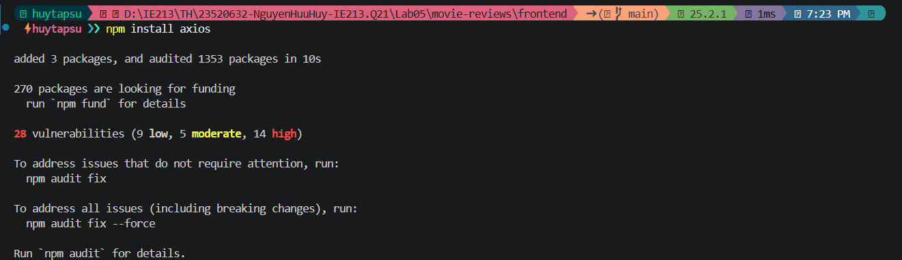

#### 1.2 Tạo lớp dịch vụ có tên MovieDataService trong thư mục .src/services/movies.js

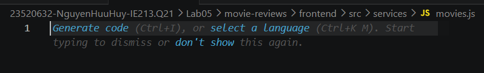

#### 1.3 Tạo các lời gọi dịch vụ tới backend, sử dụng axios để gọi bao gồm:

- getAll();
- get(id);
- createReview(data);
- updateReview(data);
- deleteReview(data);
- getRatings().

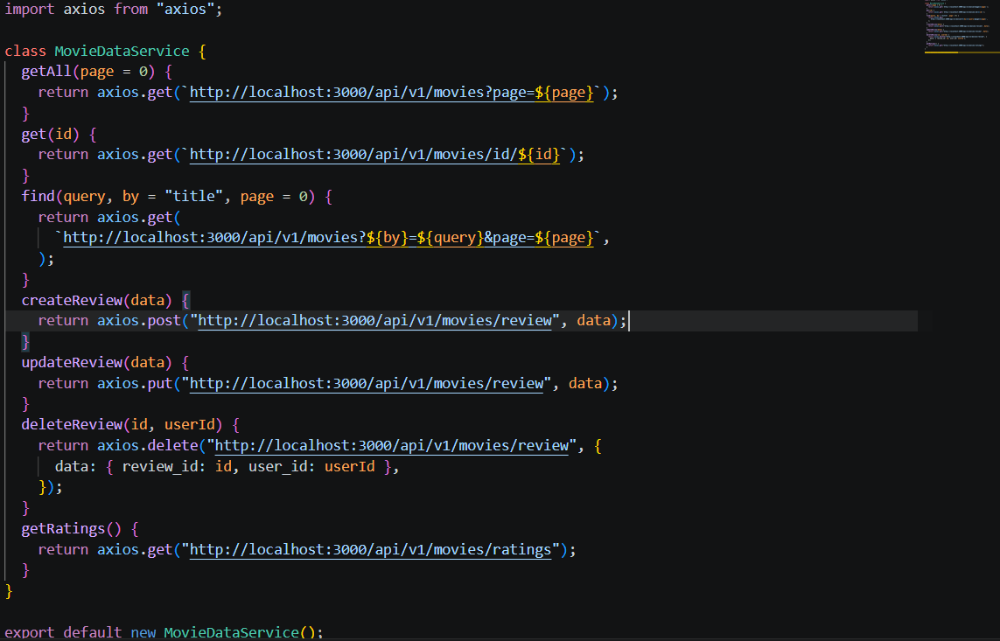

### Bài 2: Xây dựng MoviesList Component

#### 2.1 Tạo các biến trạng thái: movies, searchTitle, searchRating, ratings sử dụng useState()

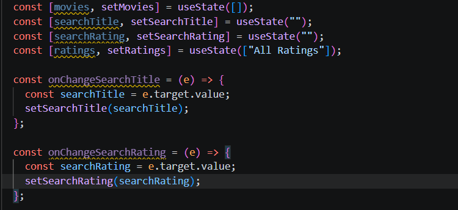

#### 2.2 Tạo 2 phương thức retrieveMovies() và retrieveRatings() để lấy thông tin movie cùng danh sách các loại ratings. Và dùng useEffect() để gọi chung sau khi giao diện kết xuất xong

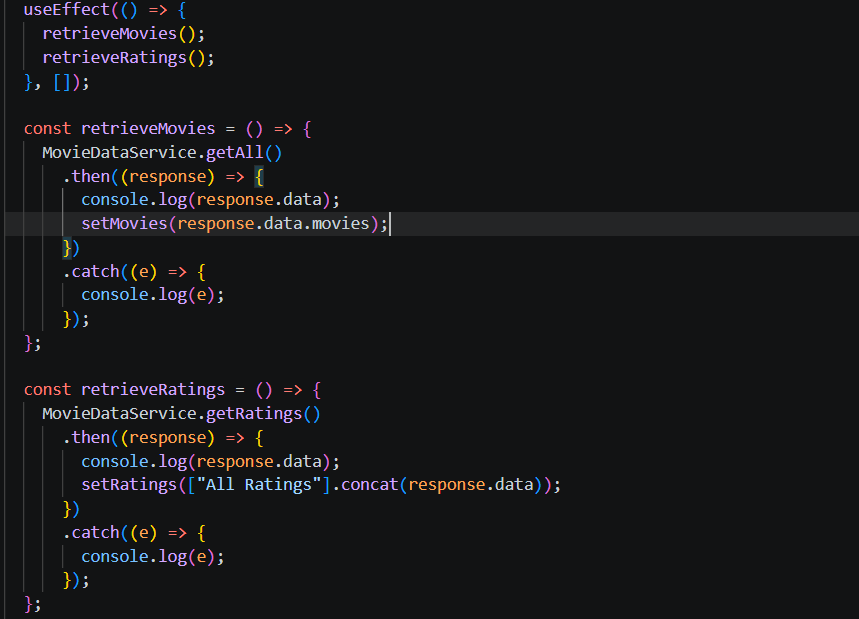

#### 2.3 Tạo 2 search form gồm tìm theo title, và tìm theo rating.

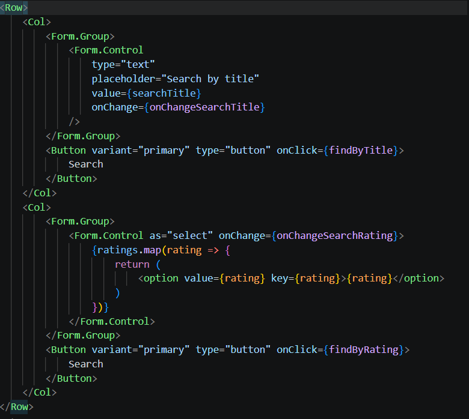

#### 2.4 Hiển thị các movie bằng <Card> của React-bootstrap.

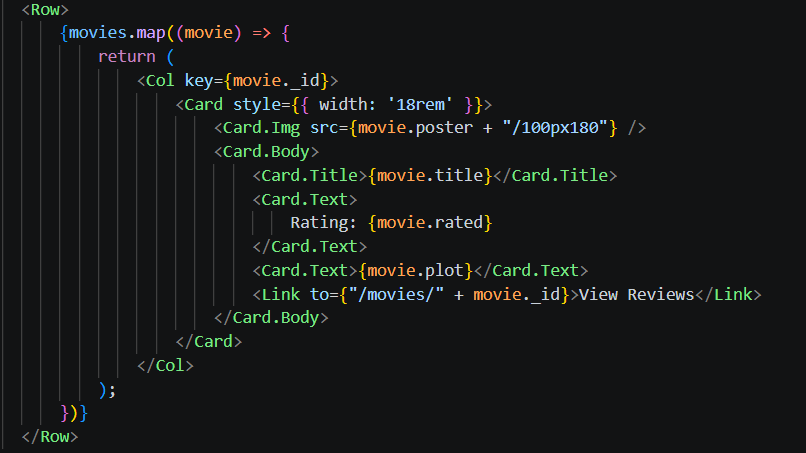

#### 2.5 Hiện thực 2 phương thức findByTitle() và findByRating() để tìm phim theo Title hoặc Rating.

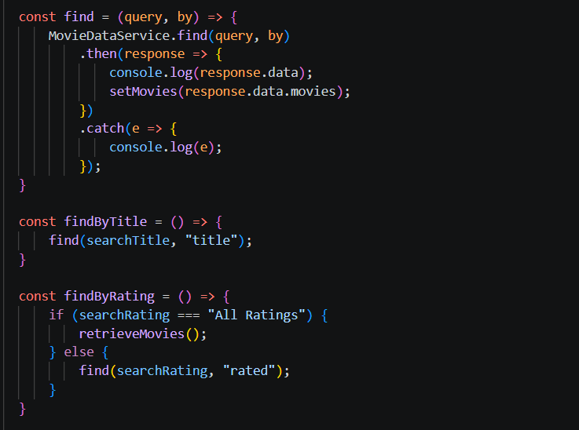

### Bài 3. Hiển thị thông tin trang movie khi nhấn vào 'View Reviews'.

#### 3.1 + 3.2 Thiết lập mã nguồn cho component Movie trong tệp tin ./components/movie.js + 3.2 Xây dựng mã nguồn cho phương thức getMovie() trong component này để gọi phương thức get() trong MovieDataService.

  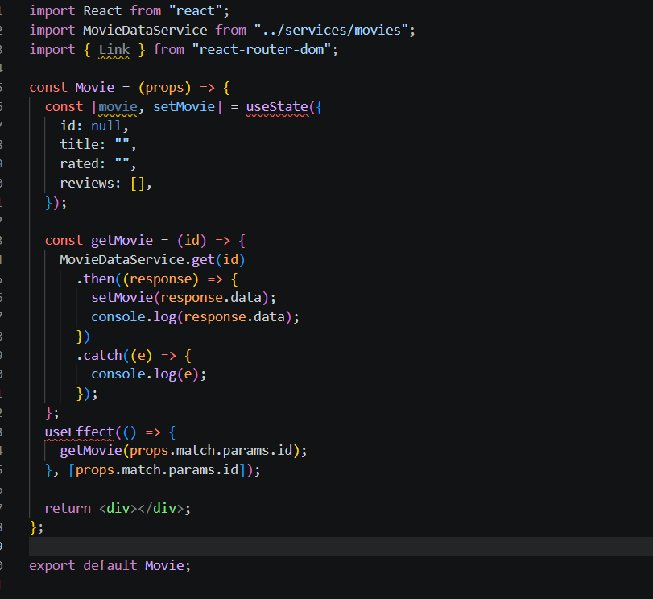

#### 3.3 Trang trí JSX

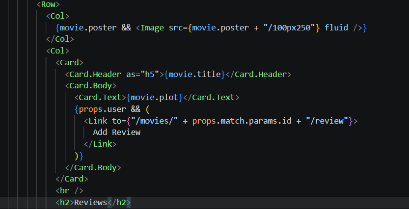

### Bài 4. Hiển thị danh sách review tương ứng cho từng phim dưới phần Plot.

#### 4.1 Viết đoạn mã nguon JSX cho phép hiển thị danh sách review cho phim.

Do sử dụng Bootstrap 5, Component <Media> đã bị loại bỏ, thay vào đó sử dụng <Card> để bọc các review lại giúp giao diện vẫn hiển thị chuẩn xác.

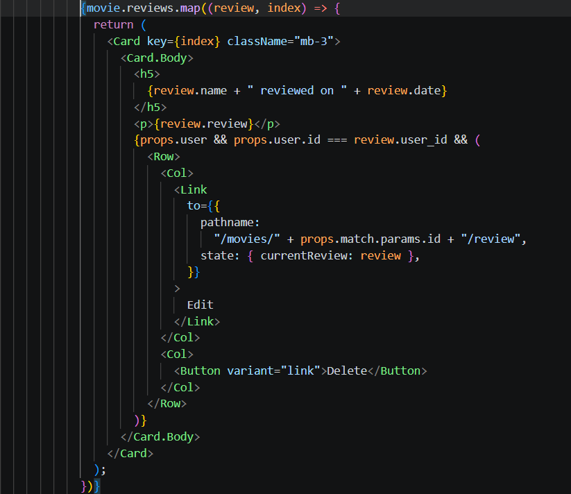

#### 4.2 Điều chỉnh lại cách hiện giờ với momentjs

Cài đặt thư viện moment

```script
npm install moment
```

## Test kết quả

### Thêm review

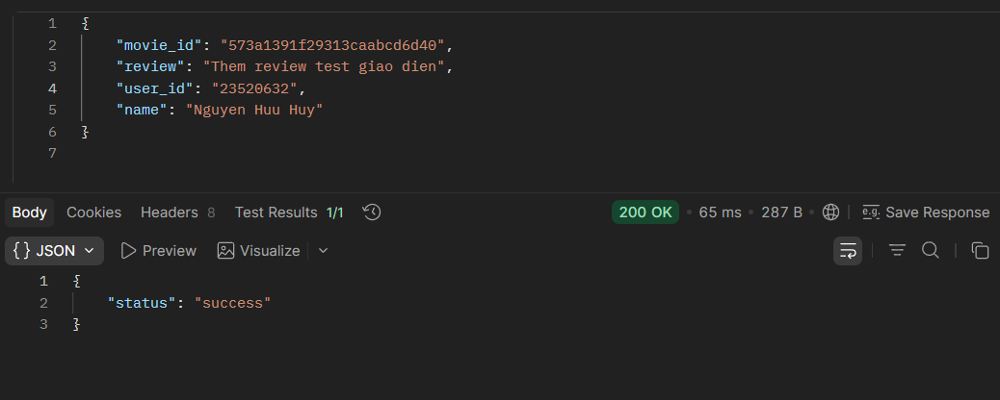

### Kết quả

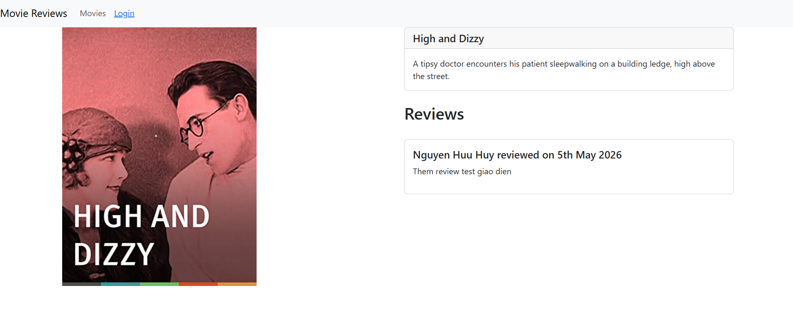
