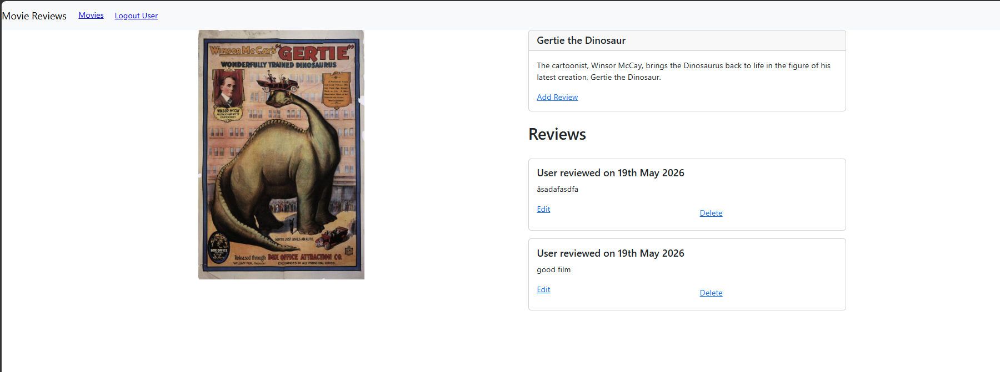

# BÀI THỰC HÀNH 6

## XÂY DỰNG FRONTEND VỚI REACTJS(Tiếp theo)

### Bài 1: Thêm và Sửa Review

#### 1.1 Tạo Login component

```javascript
import React, { useState } from "react";
import Form from "react-bootstrap/Form";
import Button from "react-bootstrap/Button";
const Login = (props) => {
  const [name, setName] = useState("");
  const [id, setId] = useState("");
  const onChangeName = (e) => {
    const name = e.target.value;
    setName(name);
  };
  const onChangeId = (e) => {
    const id = e.target.value;
    setId(id);
  };
  const login = () => {
    props.login({ name: name, id: id });
    props.history.push("/");
  };
  return (
    <div>
      <Form>
        <Form.Group>
          <Form.Label>Username</Form.Label>
          <Form.Control
            type="text"
            placeholder="Enter username"
            value={name}
            onChange={onChangeName}
          />
        </Form.Group>
        <Form.Group>
          <Form.Label>ID</Form.Label>
          <Form.Control
            type="text"
            placeholder="Enter id"
            value={id}
            onChange={onChangeId}
          />
        </Form.Group>
        <Button variant="primary" onClick={login}>
          Submit
        </Button>
      </Form>
    </div>
  );
};
export default Login;
```



#### 1.2 & 1.3 Xây dựng tính năng Thêm và Sửa Review

```javascript
import React, { useState } from "react";
import MovieDataService from "../services/movies";
import { Link, useLocation, useParams } from "react-router-dom";
import Form from "react-bootstrap/Form";
import Button from "react-bootstrap/Button";

const AddReview = (props) => {
  let editing = false;
  let initialReviewState = "";
  const { id } = useParams();
  const location = useLocation();

  if (location.state && location.state.currentReview) {
    editing = true;
    initialReviewState = location.state.currentReview.review;
  }
  const [review, setReview] = useState(initialReviewState);
  // keeps track if review is submitted
  const [submitted, setSubmitted] = useState(false);
  const onChangeReview = (e) => {
    const review = e.target.value;
    setReview(review);
  };

  const saveReview = () => {
    var data = {
      review: review,
      name: props.user.name,
      user_id: props.user.id,
      movie_id: id, // get movie id directly from url
    };
    if (editing) {
      // get existing review id
      data.review_id = location.state.currentReview._id;
      MovieDataService.updateReview(data)
        .then((response) => {
          setSubmitted(true);
          console.log(response.data);
        })
        .catch((e) => {
          console.log(e);
        });
    } else {
      MovieDataService.createReview(data)
        .then((response) => {
          setSubmitted(true);
        })
        .catch((e) => {
          console.log(e);
        });
    }
  };
  return (
    <div>
      {submitted ? (
        <div>
          <h4>Review submitted successfully</h4>
          <Link to={"/movies/" + id}>Back to Movie</Link>
        </div>
      ) : (
        <Form>
          <Form.Group>
            <Form.Label>{editing ? "Edit" : "Create"} Review</Form.Label>
            <Form.Control
              type="text"
              required
              value={review}
              onChange={onChangeReview}
            />
          </Form.Group>
          <Button variant="primary" onClick={saveReview}>
            Submit
          </Button>
        </Form>
      )}
    </div>
  );
};
export default AddReview;
```

### Bài 2: Xoá review

Bổ sung phương thức deleteReview() vào bên trong movie.js và gắn sự kiện onClick vào nút Delete để trực tiếp loại bỏ phần tử đánh giá đã xoá ra khỏi mảng trạng thái cục bộ giúp giao diện cập nhật ngay lập tức sau khi gọi hàm API thành công.

```javascript
const deleteReview = (reviewId, index) => {
  console.log("reviewId gửi lên:", reviewId);
  console.log("userId gửi lên:", props.user.id);

  MovieDataService.deleteReview(reviewId, props.user.id)
    .then((response) => {
      console.log("Delete response:", response.data);

      setMovie((prevState) => ({
        ...prevState,
        reviews: prevState.reviews.filter((_, i) => i !== index),
      }));
    })
    .catch((e) => {
      console.log("Delete error:", e.response?.data || e.message);
    });
};
```

### Bài 3: Lấy dữ liệu cho trang tiếp theo (Phân trang)

#### 3.1 & 3.2 Tích hợp Phân trang và Quản lý Search Mode

Cập nhật movies-list.js để bổ sung tính năng phân trang

```javascript
const [currentPage, setCurrentPage] = useState(0);
const [entriesPerPage, setEntriesPerPage] = useState(0);
const [currentSearchMode, setCurrentSearchMode] = useState("");
useEffect(() => {
  setCurrentPage(0);
}, [currentSearchMode]);

useEffect(() => {
  retrieveNextPage();
}, [currentPage]);

const retrieveNextPage = () => {
  if (currentSearchMode === "findByTitle") {
    findByTitle();
  } else if (currentSearchMode === "findByRating") {
    findByRating();
  } else {
    retrieveMovies();
  }
};
```
