# Lab 3

## Bài 1. Thiết lập định tuyến cho các thao tác với review trong ứng dụng minh họa

- 1.1 Định tuyến này sẽ có đường dẫn cuối cùng là /review
- 1.2 Thiết lập định tuyến thêm review (POST)
- 1.3 Thiết lập định tuyến sửa review (PUT)
- 1.4 Thiết lập định tuyến xoá review (DELETE)

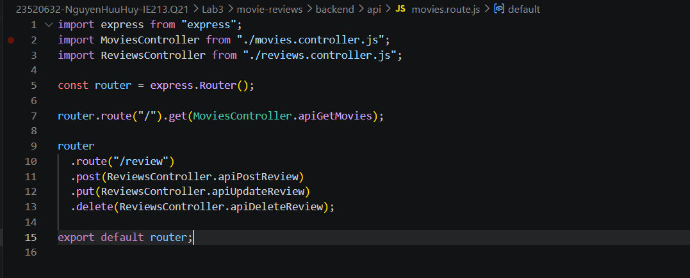

## Bài 2. Thiết lập Controller cho Reviews

### 2.1 Tạo tệp tin reviews.controller.js trong thư mục api chứa class ReviewsController để quản lý các yêu cầu liên quan đến review.

Tệp tin review.controller.js
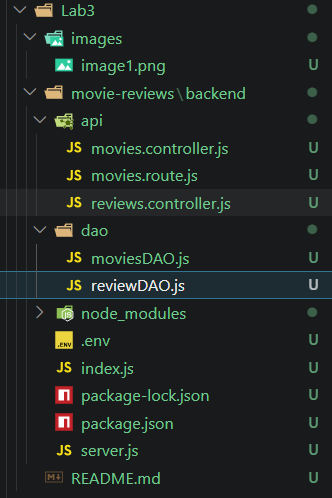

### 2.2 Import nội dung từ tệp reviewDAO.js

Lệnh import
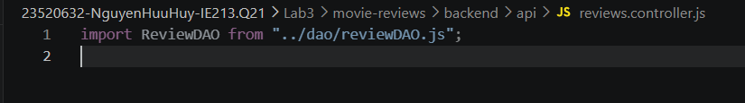

### 2.3 Tạo phương thức apiPostReview()

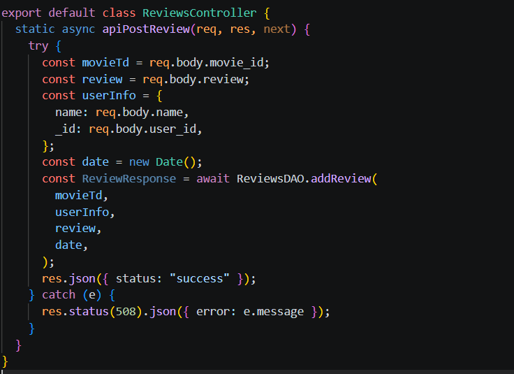

### 2.4 Tạo phương thức apiUpdateReview()

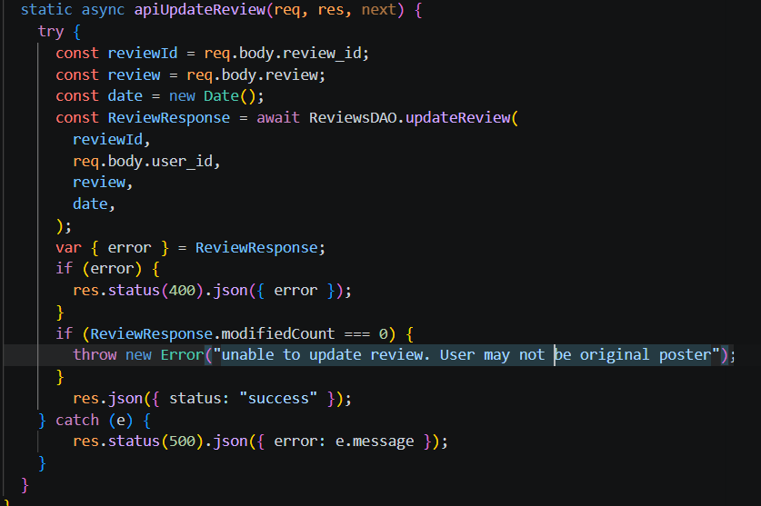

### 2.5 Tạo phương thức apiDeleteReview()

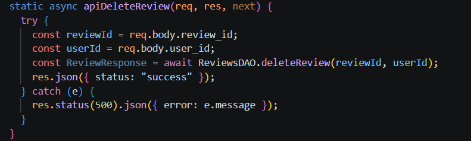

## Bài 3. Thiết lập DAO cho reviews

### 3.1 Trong thư mục dao khởi tạo reviewsDAO.js. Import package mongodb, tạo ObjectID và tạo biến reviews để tham chiếu tới collection reviews sẽ tạo sau trên DB

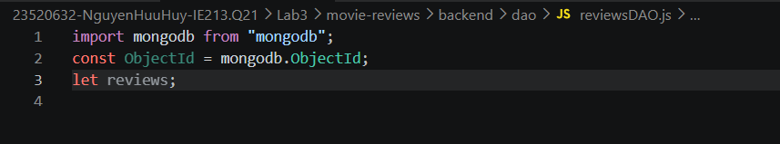

### 3.2 Tạo phương thức injectDB() để kết nối tới collection trên DB

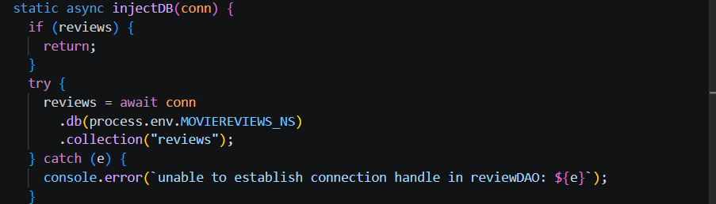

### 3.3 Tạo phương thức addReview() để thêm reviews vào DB

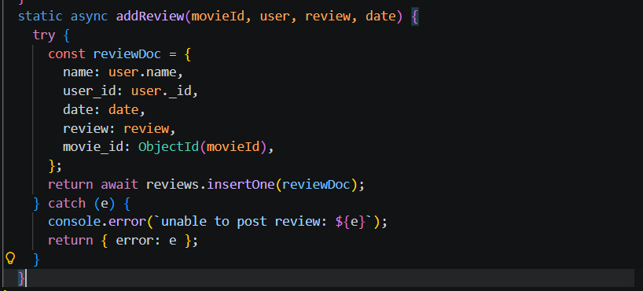

### 3.4 Tạo phương thức updateReview() để sửa review trên DB

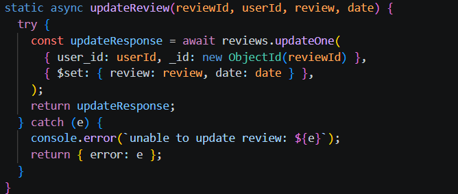

### 3.5 Tạo phương thức deleteReview() để xóa review khỏi DB

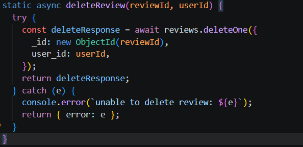

### 3.6 Thử nghiệm các API

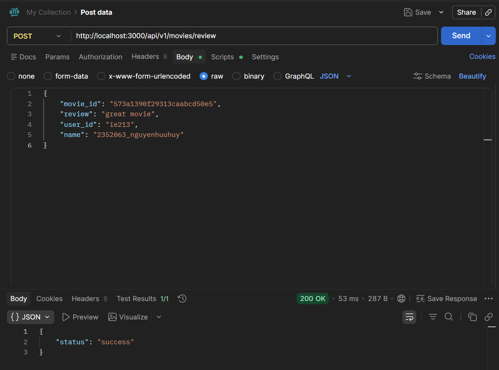
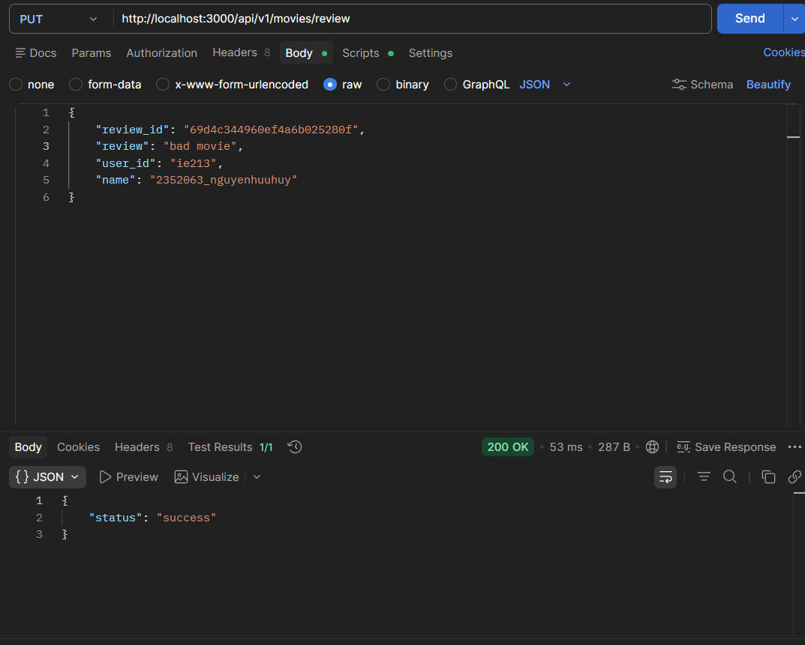
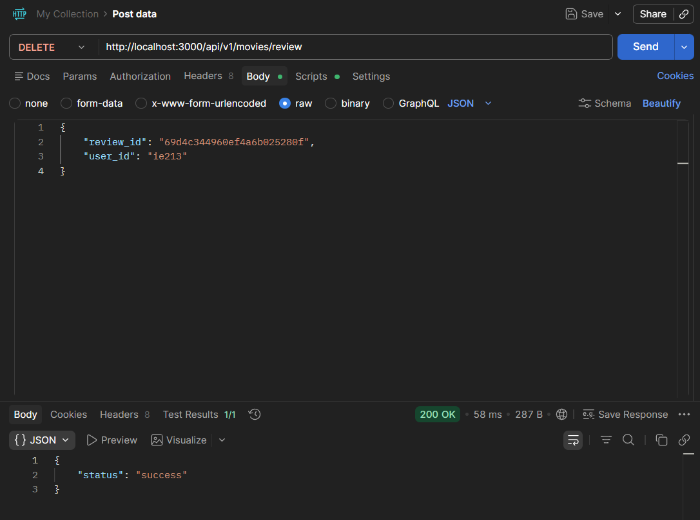

## Bài 4. Hoàn thành back-end cho ứng dụng minh họa

### 4.1 Thêm 2 định tuyến mới (định tuyến lấy tất cả thông tin phim dựa trên ID và định tuyến lấy tất cả loại rating của phim)

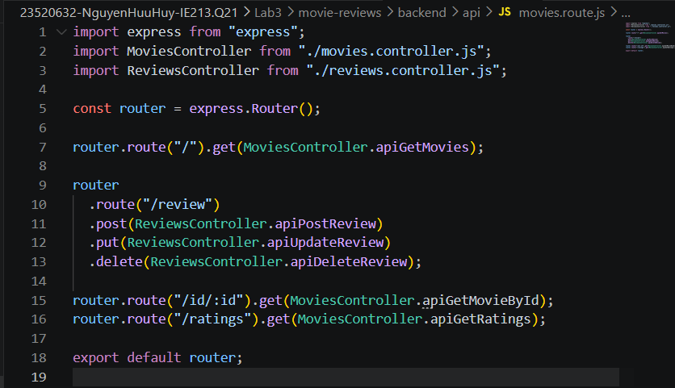

### 4.2 Thêm 2 phương thức apiGetMovieById() và apiGetRatings() vào movies.controller.js.

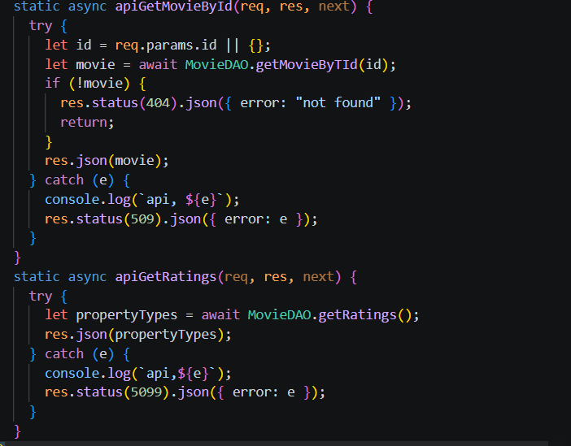

### 4.3 Thêm 2 phương thức getMovieById() và getRatings() vào moviesDAO.js.

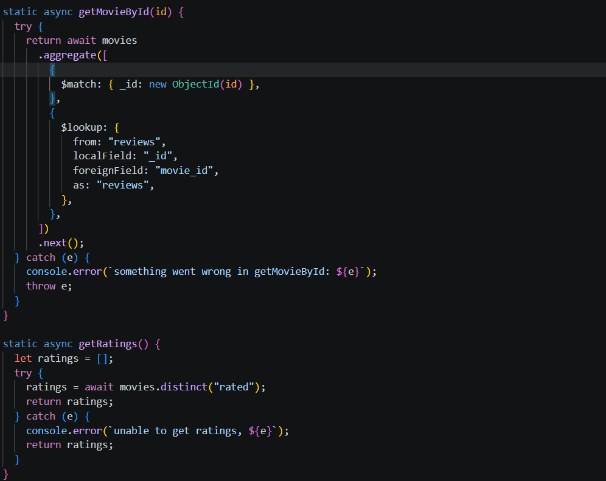

### 4.4 Thử nghiệm các API

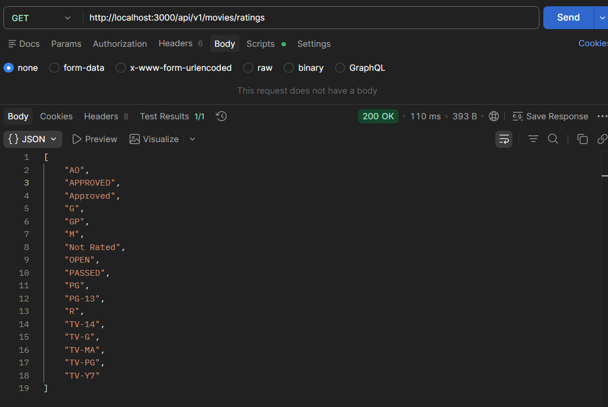
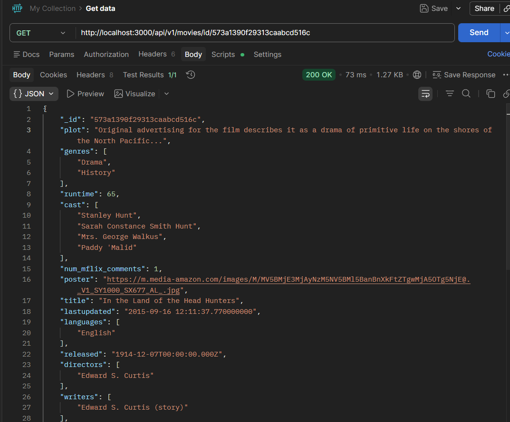
